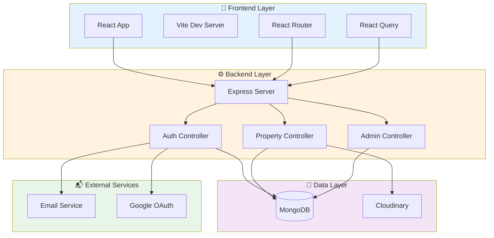
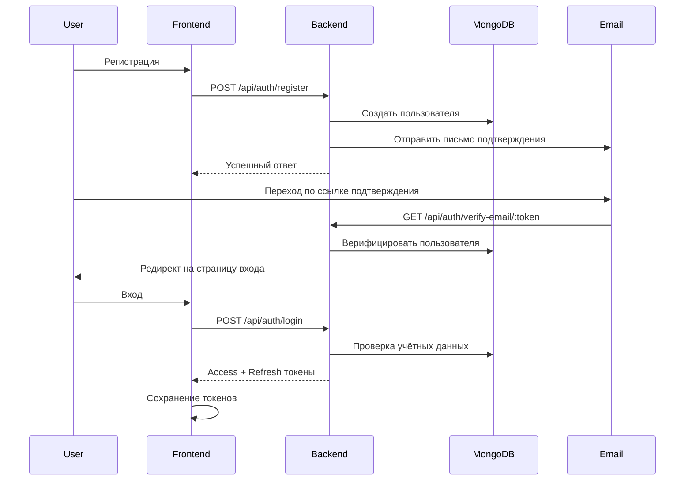
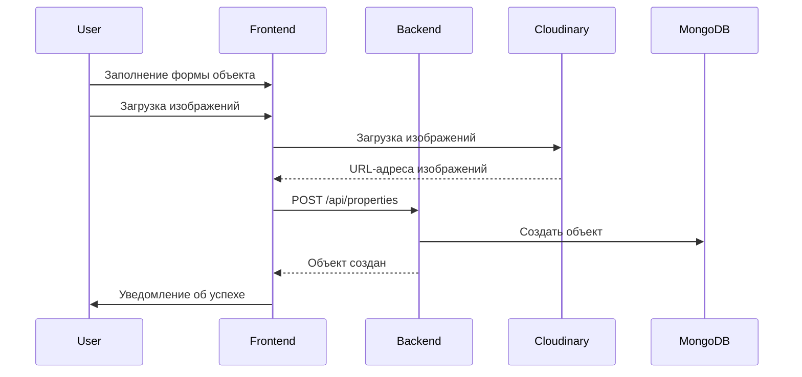

<div align="center">

# 🏠 Nadlan — платформа для недвижимости

[](https://borisnadlan.netlify.app)
[](https://borisnadlan.netlify.app/terms-of-service)
[](https://borisnadlan.netlify.app/privacy-policy)

**Полнофункциональное приложение для поиска, публикации и управления объектами недвижимости**

[🚀 Возможности](#-возможности) • [🏗️ Архитектура](#️-архитектура) • [⚙️ Установка](#️-установка) • [📚 Документация](#-документация)

</div>

---

## 📢 Важное примечание

> 🚧 **Этап активной разработки**
>
> Платформа NADLAN активно развивается, постоянно добавляются новые функции. Мы строим гибкую и масштабируемую экосистему для участников рынка недвижимости: агентств, независимых риелторов и компаний-застройщиков.
>
> 🎯 **В ближайших версиях:**
> - 🔧 Специализированные инструменты для поставщиков услуг
> - ⚙️ Гибкие настройки под тип поставщика
> - 📊 Расширенная аналитическая панель
> - 🔔 Уведомления в реальном времени
> - 💬 Улучшённые инструменты коммуникации
>
> Во время активной разработки некоторые функции могут быть временно ограничены.

---

## 🚀 Возможности

<table>
<tr>
<td width="50%">

### 👤 Возможности для пользователя
- ✅ Регистрация и аутентификация
- 🔐 JWT + Google OAuth 2.0
- 📧 Подтверждение электронной почты
- 🔑 Восстановление пароля
- 👤 Профиль пользователя и статистика
- ⭐ Система избранного

- 💬 Отзывы и рейтинги
- 📞 Запросы на контакт

</td>
<td width="50%">

### 🏢 Управление объектами
- ➕ Создание и редактирование объявлений
- 📸 Загрузка изображений (Cloudinary)
- 💾 Поддержка черновиков
- 🔍 Расширенный поиск и фильтры
- 🏘️ Автодополнение города
- 📊 Статистика по объектам
- 🔗 Похожие объекты
- 🗺️ Интерактивные карты (скоро)

</td>
</tr>
<tr>
<td width="50%">

### 🛡️ Админ-панель
- 👥 Управление пользователями
- 🏠 Модерация объявлений
- 📊 Аналитическая панель
- 🔧 Системные настройки
- 📝 Управление контентом

</td>
<td width="50%">

### 🎨 UX/UI
- 🌓 Тёмная/светлая тема
- 📱 Адаптивный дизайн
- ⚡ Высокая производительность
- 🍪 Управление cookie-файлами
- 💡 Раздел помощи и FAQ
- 🐛 Сообщения об ошибках

</td>
</tr>
</table>

---

## 🏗️ Архитектура

<details>
<summary><b>📐 Нажмите, чтобы посмотреть диаграмму архитектуры системы</b></summary>



### 📁 Структура проекта

```
NADLAN/
├── 🔧 nadlan_back/          # Бэкенд (Node.js + Express)
│   ├── config/              # Конфигурационные файлы
│   ├── controllers/         # Бизнес-логика
│   ├── middleware/          # Авторизация, валидация, загрузка
│   ├── models/              # Схемы MongoDB
│   ├── routes/              # API-маршруты
│   ├── utils/               # Вспомогательные функции и сервисы
│   └── server.js            # Точка входа
│
└── 🎨 nadlan_front/         # Фронтенд (React + Vite)
  ├── src/
  │   ├── components/      # Переиспользуемые компоненты
  │   ├── context/         # React Context
  │   ├── hooks/           # Кастомные хуки
  │   ├── pages/           # Страницы/роуты
  │   ├── services/        # API-сервисы
  │   └── utils/           # Вспомогательные функции
  └── vite.config.js       # Конфигурация Vite
```

</details>

---

## 🔧 Бэкенд (`nadlan_back`)

<details open>
<summary><b>📦 Технологический стек</b></summary>

| Технология | Назначение |
|------------|---------|
|  | Среда выполнения |
|  | Веб‑фреймворк |
|  | База данных |
|  | Аутентификация |
|  | OAuth (Google) |
|  | Хранение изображений |
|  | Почтовый сервис |

</details>

<details>
<summary><b>🛣️ Обзор API‑маршрутов</b></summary>

### 🔐 Аутентификация (`/api/auth`)
```
POST   /register              - Регистрация нового пользователя
POST   /login                 - Вход по логину/паролю
POST   /logout                - Выход из системы
POST   /refresh-token         - Обновление access‑токена
GET    /verify-email/:token   - Подтверждение email‑адреса
POST   /resend-verification   - Повторная отправка письма подтверждения
POST   /forgot-password       - Запрос на смену пароля
POST   /reset-password/:token - Сброс пароля
GET    /profile               - Получить профиль пользователя
PUT    /profile               - Обновить профиль пользователя
DELETE /profile               - Удалить аккаунт
GET    /profile/stats         - Статистика пользователя
GET    /google                - Вход через Google OAuth
GET    /google/callback       - Callback Google OAuth
```

### 🏠 Объекты недвижимости (`/api/properties`)
```
GET    /                      - Поиск объектов (c фильтрами)
GET    /stats                 - Статистика по объектам
GET    /mine                  - Объявления текущего пользователя
GET    /:id                   - Детальная страница объекта
GET    /:id/similar           - Похожие объекты
POST   /                      - Создать новый объект
POST   /draft                 - Сохранить черновик
PUT    /:id                   - Обновить объект
DELETE /:id                   - Удалить объект
POST   /upload-images         - Загрузить изображения объекта

⭐ Избранное
GET    /user/favorites        - Получить список избранного
POST   /:id/favorites         - Добавить в избранное
DELETE /:id/favorites         - Удалить из избранного

💬 Отзывы и обращения
POST   /:id/reviews           - Добавить отзыв
POST   /:id/contacts          - Отправить запрос на контакт
```

### 🛡️ Админ‑раздел (`/api/admin`)
```
GET    /users                 - Список всех пользователей
GET    /users/:id             - Получить данные пользователя
PUT    /users/:id             - Обновить пользователя
DELETE /users/:id             - Удалить пользователя
GET    /properties            - Список всех объектов
PUT    /properties/:id        - Обновить объект
DELETE /properties/:id        - Удалить объект
```

### 📧 Прочие маршруты
```
POST   /api/contact           - Форма обратной связи
POST   /api/consulting        - Заявка на консультацию
POST   /api/upload            - Загрузка файлов
GET    /api/health            - Проверка состояния сервера
```

</details>

<details>
<summary><b>📊 Модели данных</b></summary>

### 👤 Модель пользователя (User)
```javascript
{
  email: String (unique, required),
  password: String (hashed),
  name: String,
  phone: String,
  role: ["user", "admin"],
  isVerified: Boolean,
  verificationToken: String,
  resetPasswordToken: String,
  favorites: [PropertyId],
  googleId: String,
  avatar: String,
  createdAt: Date,
  statistics: {
    propertiesViewed: Number,
    searchesMade: Number,
    favoritesAdded: Number
  }
}
```

### 🏠 Модель объекта недвижимости (Property)
```javascript
{
  title: String (required),
  description: String,
  price: Number (required),
  address: {
    city: String,
    street: String,
    houseNumber: String,
    apartmentNumber: String
  },
  propertyType: ["apartment", "house", "land", "commercial"],
  dealType: ["sale", "rent"],
  area: Number,
  rooms: Number,
  floor: Number,
  totalFloors: Number,
  images: [String],
  owner: UserId (required),
  status: ["active", "draft", "sold", "archived"],
  favorites: [UserId],
  reviews: [{
    user: UserId,
    rating: Number,
    comment: String,
    createdAt: Date
  }],
  contacts: [{
    name: String,
    email: String,
    phone: String,
    message: String,
    createdAt: Date
  }],
  createdAt: Date,
  updatedAt: Date
}
```

</details>

<details>
<summary><b>🔐 Механизмы безопасности</b></summary>

- 🛡️ **Helmet.js** — защита HTTP‑заголовков
- 🚦 **Rate Limiting** — защита от DDoS и подборов пароля
- 🔒 **JWT Tokens** — безопасная аутентификация
- 🔑 **Хеширование паролей** — шифрование через bcrypt
- 📧 **Подтверждение email** — валидация аккаунтов
- 🌐 **CORS** — контроль разрешённых источников
- 🔍 **Валидация входных данных** — схемы Joi
- 📝 **Логирование** — Winston + Morgan
- 🚨 **Обработка ошибок** — централизованный middleware

</details>

<details>
<summary><b>⚙️ Переменные окружения</b></summary>

```bash
# Сервер
NODE_ENV=development
PORT=3000

# База данных
MONGODB_URI=mongodb://localhost:27017/nadlan
MONGODB_URI_PROD=mongodb+srv://...

# Сессии
SESSION_SECRET=your-session-secret

# JWT
JWT_ACCESS_SECRET=your-access-secret
JWT_REFRESH_SECRET=your-refresh-secret
JWT_ACCESS_EXPIRES=15m
JWT_REFRESH_EXPIRES=7d

# Клиент
CLIENT_ORIGIN=http://localhost:5173

# Ограничение запросов
RATE_LIMIT_WINDOW_MS=900000
RATE_LIMIT_MAX_REQUESTS=100

# Email (SMTP)
SMTP_HOST=smtp.example.com
SMTP_PORT=587
SMTP_USER=your-email@example.com
SMTP_PASS=your-password
SMTP_FROM="Nadlan <no-reply@example.com>"

# Cloudinary
CLOUDINARY_CLOUD_NAME=your-cloud-name
CLOUDINARY_API_KEY=your-api-key
CLOUDINARY_API_SECRET=your-api-secret

# Google OAuth
GOOGLE_CLIENT_ID=your-client-id.apps.googleusercontent.com
GOOGLE_CLIENT_SECRET=your-client-secret
GOOGLE_CALLBACK_URL=http://localhost:3000/api/auth/google/callback
```

</details>

---

## 🎨 Фронтенд (`nadlan_front`)

<details open>
<summary><b>⚡ Технологический стек</b></summary>

| Технология | Назначение |
|------------|---------|
|  | UI‑библиотека |
|  | Инструмент сборки |
|  | Маршрутизация |
|  | Получение и кеширование данных |
|  | Библиотека компонентов |
|  | Utility‑CSS |
|  | HTTP‑клиент |
|  | Управление формами |

</details>

<details>
<summary><b>📄 Страницы и маршруты</b></summary>

### 🏠 Публичные страницы
- `/` — главная страница с поиском
- `/properties` — каталог объектов
- `/properties/:id` — страница объекта
- `/about` — о платформе
- `/contact` — форма обратной связи
- `/consulting` — консультационные услуги
- `/help` — центр помощи
- `/faq` — часто задаваемые вопросы

### 🔐 Страницы аутентификации
- `/login` — вход пользователя
- `/register` — регистрация пользователя
- `/forgot-password` — восстановление пароля
- `/reset-password/:token` — сброс пароля
- `/verify-email/:token` — подтверждение email
- `/auth/success` — успешный вход через OAuth
- `/auth/error` — ошибка аутентификации OAuth

### 👤 Пользовательские страницы (защищённые)
- `/profile` — профиль пользователя
- `/my-listings` — мои объявления
- `/favorites` — избранные объекты
- `/create-property` — создание нового объявления

### 🛡️ Админ‑страницы (только для админа)
- `/admin` — панель администратора

### ℹ️ Юридическая информация и сервисные страницы
- `/privacy` — политика конфиденциальности
- `/terms` — условия использования
- `/cookies` — политика cookie
- `/report` — сообщить о проблеме
- `/support` — страница поддержки/чата

</details>

<details>
<summary><b>🧩 Ключевые компоненты</b></summary>

### Layout
- `Layout` — основной layout‑контейнер
- `Header` — шапка, навигация и статус авторизации
- `Footer` — подвал с навигацией и ссылками

### UI‑компоненты
- `Button` — стилизованные кнопки
- `Card` — карточка объекта недвижимости
- `Badge` — бейджи статусов
- `Input` — элементы ввода форм
- `Modal` — модальные окна
- `Loader` — индикаторы загрузки
- `Toast` — уведомления

### Компоненты объектов
- `PropertyCard` — превью объекта
- `PropertyGrid` — сетка объектов
- `PropertyFilters` — панель фильтров
- `PropertyForm` — форма создания/редактирования объявления
- `ImageUploader` — загрузка изображений
- `CityAutocomplete` — выбор города с автодополнением

### Функциональные компоненты
- `AuthForm` — формы логина/регистрации
- `UserMenu` — меню пользователя
- `FavoriteButton` — кнопка добавления в избранное
- `ReviewForm` — форма отзыва
- `ContactForm` — форма связи с владельцем
- `CookieBanner` — баннер согласия на cookie

</details>

<details>
<summary><b>🎣 Пользовательские хуки</b></summary>

```javascript
// Аутентификация
useAuth()              // Контекст и методы авторизации
useUser()              // Данные текущего пользователя

// Объекты недвижимости
useProperties()        // Получение списка объектов
useProperty(id)        // Получение одного объекта
useCreateProperty()    // Создание нового объекта
useUpdateProperty()    // Обновление объекта
useDeleteProperty()    // Удаление объекта

// Избранное
useFavorites()         // Список избранных объектов
useToggleFavorite()    // Добавление/удаление из избранного

// Тема
useTheme()             // Контекст темы (тёмная/светлая)

// Валидация
usePropertyValidation() // Валидация формы объекта
```

</details>

<details>
<summary><b>⚙️ Переменные окружения</b></summary>

```bash
# Настройки API
VITE_API_BASE_URL=http://localhost:3000/api

# Google OAuth
VITE_GOOGLE_CLIENT_ID=your-client-id.apps.googleusercontent.com

# Cloudinary
VITE_CLOUDINARY_CLOUD_NAME=your-cloud-name
VITE_CLOUDINARY_UPLOAD_PRESET=your-upload-preset

# Необязательные
VITE_ENABLE_ANALYTICS=false
VITE_MAP_API_KEY=your-map-api-key
```

</details>

<details>
<summary><b>🎨 Тема и стили</b></summary>

### Система тем
- 🌓 Переключатель тёмной/светлой темы
- 💾 Сохранение выбранной темы
- 🎨 Кастомная цветовая палитра
- 📱 Адаптивные брейкпоинты

### Подход к стилизации
- **Tailwind CSS** — utility‑классы для вёрстки
- **Material UI** — готовые компоненты
- **CSS Modules** — стили на уровне компонентов
- **Custom CSS** — глобальные стили и анимации

### Цветовая палитра
```css
/* Primary Colors */
--primary: #2563eb
--primary-dark: #1e40af
--primary-light: #60a5fa

/* Status Colors */
--success: #10b981
--warning: #f59e0b
--error: #ef4444
--info: #3b82f6
```

</details>

---

## ⚙️ Установка

<details open>
<summary><b>📋 Предварительные требования</b></summary>

Перед началом убедитесь, что у вас установлено:

- 
- 
- 
- 

</details>

### 🚀 Быстрый старт

<details>
<summary><b>1️⃣ Клонирование репозитория</b></summary>

```bash
git clone https://github.com/boris2024-spec/NADLAN.git
cd NADLAN
```

</details>

<details>
<summary><b>2️⃣ Настройка бэкенда</b></summary>

```bash
# Перейдите в директорию бэкенда
cd nadlan_back

# Установите зависимости
npm install

# Создайте файл окружения
cp .env.example .env

# Заполните .env своими значениями
# Обязательно: MongoDB URI, JWT‑секреты, SMTP‑доступ, ключи Cloudinary

# Запустите сервер разработки
npm run dev

# Или в режиме продакшена
npm start
```

**Бэкенд по умолчанию доступен по адресу:** `http://localhost:3000`

**Проверка состояния:** `http://localhost:3000/api/health`

</details>

<details>
<summary><b>3️⃣ Настройка фронтенда</b></summary>

Откройте **новое окно терминала**:

```bash
# Перейдите в директорию фронтенда
cd nadlan_front

# Установите зависимости
npm install

# Создайте файл окружения
cp .env.example .env

# Пропишите URL бэкенда в .env
# VITE_API_BASE_URL=http://localhost:3000/api

# Запустите сервер разработки
npm run dev
```

**Фронтенд по умолчанию доступен по адресу:** `http://localhost:5173`

</details>

<details>
<summary><b>4️⃣ Подготовка базы данных (опционально)</b></summary>

```bash
# Перейдите в директорию со скриптами бэкенда
cd nadlan_back/scripts

# Наполнить базу тестовыми объектами
node seed-properties.mjs

# Добавить тестовые контакты
node add-test-contacts.mjs

# Просмотреть добавленные контакты
node view-contacts.mjs
```

</details>

### 🐳 Docker‑окружение (в разработке)

```bash
# Запустить весь стек через Docker Compose
docker-compose up -d

# Backend: http://localhost:3000
# Frontend: http://localhost:5173
# MongoDB: localhost:27017
```

---

## 📚 Документация

<details>
<summary><b>🔍 Документация по API</b></summary>

### Сценарий аутентификации



### Сценарий создания объекта



</details>

<details>
<summary><b>🛠️ Скрипты для разработки</b></summary>

### Скрипты бэкенда

| Команда | Описание |
|---------|-------------|
| `npm start` | Запуск сервера в продакшене |
| `npm run dev` | Запуск сервера разработки (nodemon) |
| `npm test` | Запуск тестов |
| `npm run lint` | Запуск линтера |

### Скрипты фронтенда

| Команда | Описание |
|---------|-------------|
| `npm run dev` | Запуск dev‑сервера |
| `npm run build` | Сборка для продакшена |
| `npm run preview` | Предпросмотр production‑сборки |
| `npm run lint` | Запуск линтера |

### Вспомогательные скрипты (бэкенд)

```bash
# Операции с базой данных
node scripts/seed-properties.mjs        # Добавить тестовые объекты
node scripts/clear-favorites.mjs        # Очистить все избранные
node scripts/reset-all-favorites.mjs    # Сбросить систему избранного
node scripts/migrate-address-fields.mjs # Миграция структуры адреса

# Тестирование
node scripts/test-smtp.js               # Проверить почтовый сервис
node scripts/debug-favorites.mjs        # Отладка избранного
node scripts/view-contacts.mjs          # Просмотр заявок на контакт

# Быстрые действия
node scripts/quick-create-property.mjs  # Быстро создать объект
```

</details>

<details>
<summary><b>🧪 Тестирование</b></summary>

```bash
# Тесты бэкенда
cd nadlan_back
npm test

# Тесты фронтенда
cd nadlan_front
npm test

# E2E‑тесты (в разработке)
npm run test:e2e
```

</details>

<details>
<summary><b>🚀 Деплой</b></summary>

### Деплой бэкенда (Railway/Heroku/VPS)

```bash
# Настройте переменные окружения на вашей платформе
# Соберите и задеплойте приложение
npm run build
npm start
```

### Деплой фронтенда (Netlify)

```bash
# Соберите production‑бандл
npm run build

# Задеплойте на Netlify
# Конфигурация задаётся через netlify.toml
```

### Чек‑лист окружения

- ✅ Установлен `NODE_ENV=production`
- ✅ Настроен production‑URI MongoDB
- ✅ Указаны надёжные JWT‑секреты
- ✅ Настроен SMTP для отправки почты
- ✅ Добавлены креденшелы Cloudinary
- ✅ Обновлены CORS‑домены
- ✅ Включён SSL/HTTPS
- ✅ Настроен мониторинг и логирование

</details>

---

## 🤝 Вклад в проект

Мы рады любым контрибуциям! Вот как вы можете помочь:

<details>
<summary><b>💡 Как можно помочь</b></summary>

- 🐛 Сообщать об ошибках
- 💡 Предлагать новые функции
- 📖 Улучшать документацию
- 🔧 Отправлять pull‑request’ы
- ⭐ Ставить звёздочку репозиторию
- 🔄 Делиться проектом

</details>

<details>
<summary><b>📝 Рекомендации по разработке</b></summary>

1. **Сделайте fork** репозитория
2. **Создайте** ветку с фичей (`git checkout -b feature/AmazingFeature`)
3. **Закоммитьте** изменения (`git commit -m 'Add some AmazingFeature'`)
4. **Отправьте** ветку на GitHub (`git push origin feature/AmazingFeature`)
5. **Откройте** Pull Request

### Стиль кода

- Следуйте существующим паттернам проекта
- Используйте понятные имена переменных и функций
- Добавляйте комментарии к сложной логике
- Пишите осмысленные сообщения коммитов
- Обновляйте документацию при изменениях поведения

</details>

---

## 📞 Поддержка и контакты

<div align="center">

### Нужна помощь?

[](./README.md)
[](https://github.com/boris2024-spec/NADLAN/issues)
[](https://github.com/boris2024-spec/NADLAN/discussions)

</div>

---

## 📜 Лицензия

Проект распространяется под лицензией **MIT License** — подробности см. в файле [LICENSE](LICENSE).

---

## 🌟 Благодарности

<details>
<summary><b>Проект создан с помощью отличных технологий</b></summary>

- [React](https://react.dev/) — UI‑библиотека
- [Node.js](https://nodejs.org/) — среда выполнения
- [Express](https://expressjs.com/) — веб‑фреймворк
- [MongoDB](https://www.mongodb.com/) — база данных
- [Cloudinary](https://cloudinary.com/) — управление медиафайлами
- [Material-UI](https://mui.com/) — библиотека компонентов
- [Tailwind CSS](https://tailwindcss.com/) — utility‑CSS
- [Vite](https://vitejs.dev/) — инструмент сборки

И многие другие замечательные open‑source‑проекты! 🙏

</details>

---

<div align="center">

### ⭐ Отметьте нас на GitHub!

Если проект оказался для вас полезным, поставьте ему звёздочку ⭐

[](https://github.com/boris2024-spec/NADLAN/stargazers)

Сделано с ❤️ командой Nadlan

[🔝 Наверх](#-nadlan--платформа-для-недвижимости)

</div>


